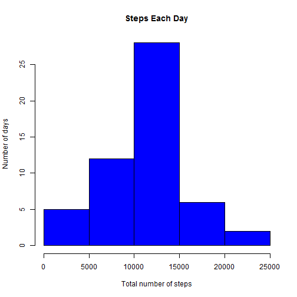
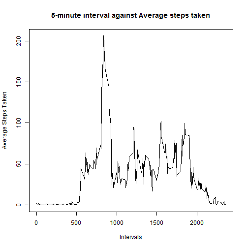
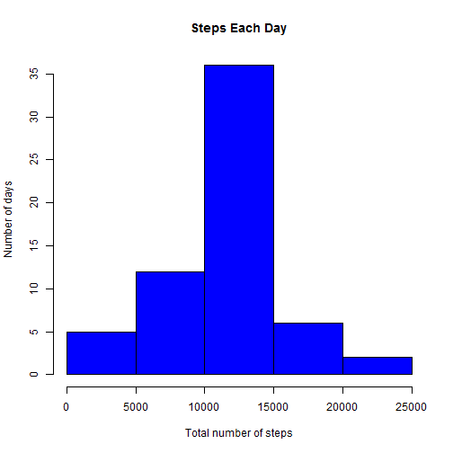
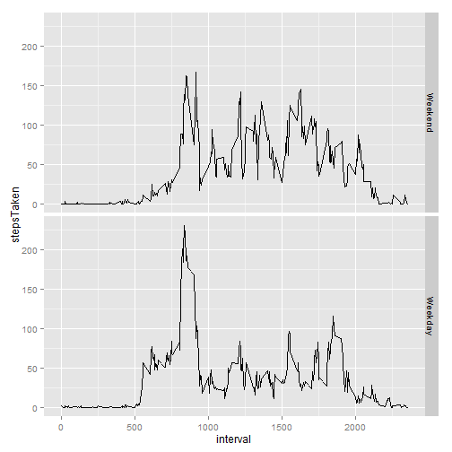

Loading and preprocessing the data
===========================================================================================================
        
Loading the data


```r
unzip("./activity.zip")
mydata <- read.csv("./activity.csv", colClasses = c("integer","Date","integer"))
```

Total number of steps per day
===========================================================================================================

Subsetting the data excluding missing (NA) values


```r
Newdata <- mydata[complete.cases(mydata),]
```

Computing total steps taken each day


```r
library(dplyr)

Newdata <- tbl_df(Newdata)
DlyNonNASteps <- Newdata %>%
        		group_by(date) %>%
			summarize(stepsTaken = sum(steps, na.rm = TRUE))
```

Plotting Histogram for steps each day


```r
hist(DlyNonNASteps$stepsTaken,
	breaks = 5, 
	col = "blue",
	border = "black",
	main = "Steps Each Day",
	xlab = "Total number of steps",
	ylab = "Number of days")
```

 

Computing Mean & Median of total steps taken each day


```r
MeanNonNAStepsPerDay <- mean(DlyNonNASteps$stepsTaken)  
MedianNonNAStepsPerDay <- median(DlyNonNASteps$stepsTaken)
```

The mean steps per day is 1.0766189 &times; 10<sup>4</sup>.  
The median steps per day is 10765.


Average daily activity pattern
===========================================================================================================

Making a time series plot (i.e. type = "l") of the 5-minute interval (x-axis) 
and the average number of steps taken, averaged across all days (y-axis)


```r
Newdata <- tbl_df(mydata)
DlySteps <- Newdata %>%
			group_by(interval) %>%
			summarize(stepsTaken = mean(steps, na.rm = TRUE))

plot(DlySteps$interval, DlySteps$stepsTaken, 
	type = "l", xlab = "Intervals", 
	ylab = "Average Steps Taken",
	main = "5-minute interval against Average steps taken")
```

 

Interval with maximum average daily steps


```r
MaxInt <- DlySteps[which.max(DlySteps$stepsTaken),1]
```

5-minute interval, on average across all the days in the dataset, which contains the maximum number of steps is 835.


Imputing missing values
===========================================================================================================

Counting missing values in the dataset


```r
NArows <- nrow(mydata[is.na(mydata),])
```
Total no of missing (NA) values in the dataset is 2304.


Strategy to replace missing values


```r
intervals <- group_by(Newdata, interval)
Newdata <- mutate(intervals, meansteps = mean(steps, na.rm = TRUE))
```

Creating new dataset after replacing the missing values with the average of their intervals


```r
Newdata[is.na(Newdata[,1]),1] <- Newdata[is.na(Newdata[,1]),4]
NonNAData <- Newdata[,c(1:3)]
```

Plotting histgrom with the new data with replaced missing values


```r
DlySteps <- NonNAData %>%
			group_by(date) %>%
			summarize(stepsTaken = sum(steps, na.rm = TRUE))

hist(DlySteps$stepsTaken,
	breaks = 5, 
	col = "blue",
	border = "black",
	main = "Steps Each Day",
	xlab = "Total number of steps",
	ylab = "Number of days")
```

 

```r
MeanStepsPerDay <- mean(DlySteps$stepsTaken)
MedianStepsPerDay <- median(DlySteps$stepsTaken)

TotalStepsDiff <- sum(DlySteps$stepsTaken) - sum(DlyNonNASteps$stepsTaken)
TotalMeanStepsDiff <- MeanStepsPerDay - MeanNonNAStepsPerDay
TotalMedianStepsDiff <- MedianStepsPerDay - MedianNonNAStepsPerDay
```

The mean steps per day after replacing NA with the average of their interval is 1.0766189 &times; 10<sup>4</sup>.  
The median steps per day after replacing NA with the average of their interval is 1.0766189 &times; 10<sup>4</sup>.  

The estimate for the mean steps per day in the first part of the assignment was 1.0766189 &times; 10<sup>4</sup>.  
The estimate for the median steps per day in the first part of the assignment was 10765.  

The difference between Estimated Total steps & Actual Total steps is 8.6129509 &times; 10<sup>4</sup>.  
The difference between mean of Estimated Total steps & mean of Actual Total steps is 0.  
The difference between median of Estimated Total steps & median of Actual Total steps is 1.1886792.  


Differences in activity patterns between weekdays and weekends
===========================================================================================================

Creating a weekday & Weekend tag basis the date


```r
NonNAData <- mutate(NonNAData, DayOfWeek = weekdays(date))

Wdays = c('Monday', 'Tuesday', 'Wednesday', 'Thursday' , 'Friday')

NonNAData <- mutate(NonNAData, 
				DayTag = factor((DayOfWeek %in% Wdays)+1L, 
								levels = 1:2, labels = c('Weekend','Weekday')))
```

Making a panel plot containing a time series plot of the 5-minute interval (x-axis) and the average number of steps taken, averaged across all weekday days or weekend days (y-axis)


```r
AvgSteps <- NonNAData %>%
		group_by(interval,DayTag) %>%
		summarize(stepsTaken = mean(steps, na.rm = TRUE))

library(ggplot2)

qplot(interval,stepsTaken, data = AvgSteps, geom = "line", facets = DayTag~.)
```

 
